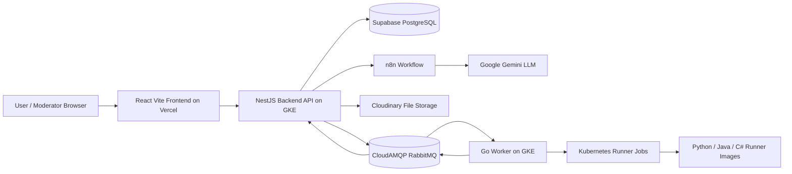
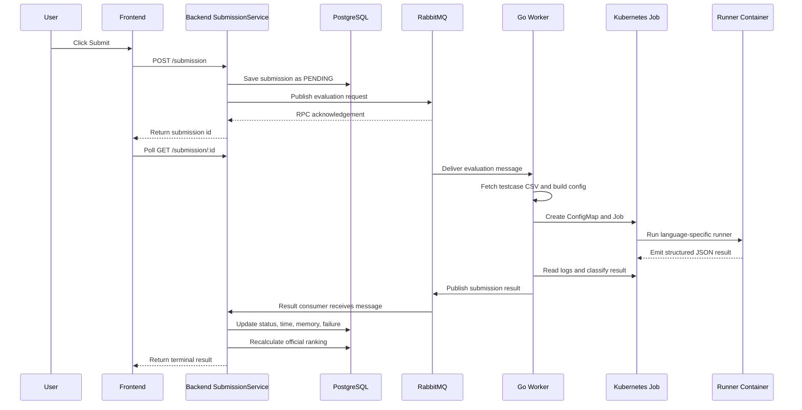

# CodeRank Architecture, Deployment, and Capstone Q&A

This document summarizes the current CodeRank codebase and the content reflected in `main.pdf` / report source files. It is intended as a capstone defense preparation note: it explains the overall architecture, deployment model, submission evaluation service, and likely university project-defense questions.

## 1. Project Overview

CodeRank is an online coding practice and evaluation platform. The system lets users browse programming problems, submit code, view judging results, participate in discussions, track rankings, and use an AI interview assistant. Moderators and superadmins can manage users, tags, problem requests, problem approval, and platform analytics.

The repository is organized as several related services:

| Folder | Responsibility |
| --- | --- |
| `code-rank-web` | React/Vite frontend for users and moderators |
| `code-rank-backend` | NestJS backend API, domain modules, database access, auth, queue integration |
| `code-rank-worker` | Go worker that consumes RabbitMQ jobs and runs submissions |
| `code-rank-gke-test` | Kubernetes deployment manifests for backend, worker, service accounts, RBAC |
| `code-rank-specialize-report` | LaTeX report source and `main.pdf` |
| `test-runner` / `code-rank-worker/static/docker-images` | Language runner implementations and runner image resources |
| `code-rank-crawl` | Supporting data collection/crawling code |

## 2. Overall Architecture

The project uses a service-based modular-monolith style rather than full microservices. The backend keeps most business modules in one deployable NestJS application, while the dangerous and resource-heavy code execution workload is separated into a Go worker and short-lived runner containers.

This is a practical capstone design choice:

- It avoids the operational complexity of many independently deployed services.
- It keeps domain boundaries clear through modules such as Auth, User, Problem, Submission, Discussion, Ranking, Chatbot, Analytics, Upload, and Notification.
- It still separates the highest-risk component, untrusted code execution, from the main API process.
- It can evolve toward microservices later because queue contracts and module boundaries already exist.

### Main Runtime Components

### Backend Layering

The backend is organized through:

- `InfrastructureModule`: configuration, database, core services.
- `DomainModule`: feature modules such as auth, users, problems, submissions, discussion, chatbot, ranking, analytics, notification.
- `CoreModule`: JWT, RabbitMQ, logging, storage, Cloudinary, queue service.
- `DatabaseModule`: TypeORM entities and PostgreSQL connection.

The report describes this as a layered architecture:

- Presentation layer: controllers and gateways receiving HTTP/WebSocket requests.
- Application layer: services/use cases coordinating workflows.
- Domain layer: entities and business rules such as submission status, reviews, users, problems, rankings.
- Infrastructure layer: TypeORM repositories, RabbitMQ adapters, external storage, WebSocket adapters, and third-party APIs.

## 3. Frontend Architecture

The frontend is a React 19 + Vite application. It uses:

- React Router for route-level navigation.
- TanStack Query for server-state fetching, caching, polling, and invalidation.
- Zustand for local UI/application state.
- Axios for backend communication.
- Monaco Editor for the code editor.
- Socket.IO client for discussion/thread real-time features.
- Tailwind/shadcn-style UI components and Radix primitives.
- Vitest for frontend tests.

Important frontend modules include:

- `modules/auth`: login, signup, Google callback, moderator login.
- `modules/problem-detail`: problem statement, code editor, submission result polling.
- `modules/problem-management`: problem creation and moderator management views.
- `modules/discussion`: discussion list, detail, comments, reactions.
- `modules/interview`: chatbot/interview assistant UI.
- `modules/moderator-dashboard`: analytics and moderator dashboard views.

Frontend requests go through `src/libs/axios/index.ts`, which attaches the bearer access token and attempts refresh-token recovery when the backend returns `invalid_access_token`.

## 4. Backend Architecture

The backend is a NestJS application. The main entry point imports:

- `InfrastructureModule`
- `DomainModule`

Core backend responsibilities:

- Authentication and authorization with JWT, refresh token flow, Google OAuth, and role guards.
- User and moderator management.
- Problem browsing and problem management.
- Problem request review workflow.
- Submission creation and result retrieval.
- RabbitMQ publishing and consuming.
- Ranking calculation.
- Discussion/comment/reaction APIs and WebSocket room management.
- Chatbot conversation storage and n8n webhook streaming.
- File upload/storage through Cloudinary.

The backend uses TypeORM with PostgreSQL. Current entities include users, problems, tags, reviews, problem requests, sample code, testcases, submissions, submission failures, discussions, comments, reactions, user reactions, conversations, messages, and notifications.

## 5. Submission Evaluation Architecture

Submission evaluation is the most important architecture topic for a capstone defense because it involves correctness, scalability, and security.

### Submission Flow

### Backend Submission Service

When a user submits code:

1. Backend validates the user and problem.
2. Backend creates a `Submission` row with status `PENDING`.
3. Backend sends a RabbitMQ evaluation request containing:
   - `submissionId`
   - `problemName` / problem slug
   - submitted source code
   - programming language
   - testcase remote URL
   - timeout
   - memory limit in KB
   - entry function
4. Frontend receives the submission id and polls result status.
5. Backend consumes the final result from `code_rank_submission_result`.
6. Backend updates submission status, runtime, memory, and failure details.
7. Backend recalculates official ranking for the submitting user.

Supported terminal statuses include:

- `ACCEPTED`
- `WRONG_ANSWER`
- `TIME_LIMIT`
- `MEMORY_LIMIT`
- `RUNTIME_ERROR`
- `COMPILE_ERROR`

### Worker Service

The Go worker is responsible for execution orchestration. It:

- Connects to RabbitMQ using `RABBITMQ_URI`.
- Consumes `code_rank_problem_creation` and `code_rank_submission_evaluation`.
- Sends an immediate acknowledgement for RPC-style backend requests.
- Runs the submission with either local Docker or GKE mode.
- Publishes results to `code_rank_submission_result`.

In cloud deployment, `RUNNER_EXECUTOR=gke`, so the worker creates Kubernetes Jobs dynamically.

### Runner Isolation

The runner model is designed so user code never runs inside the backend API. In local Docker mode, the worker runs containers with:

- no network access
- read-only root filesystem
- dropped Linux capabilities
- no privilege escalation
- memory and CPU limits
- PID limits
- non-root user
- temporary filesystem for `/tmp`
- read-only mounted solution, config, and testcase files

In GKE mode, each submission becomes a short-lived Kubernetes Job with:

- a fresh Pod per submission
- ConfigMap-mounted source/config/testcase input
- non-root security context
- read-only root filesystem
- dropped capabilities
- memory, CPU, and ephemeral-storage limits
- `activeDeadlineSeconds`
- no service account token mounted inside the runner Pod
- automatic cleanup by the worker and Kubernetes TTL

### Why RabbitMQ?

RabbitMQ decouples the user-facing API from slow and risky code execution. This improves:

- Responsiveness: the API returns quickly after queueing.
- Reliability: submissions are not lost if workers are busy.
- Scalability: more worker replicas can consume from the queue.
- Isolation: the backend does not directly manage execution state in request-response time.
- Backpressure: queue length can absorb spikes in submission traffic.

## 6. Problem Management and Testcases

Moderators create problem requests with tags, description, sample code, testcase URL, timeout, memory limit, and entry function. The review workflow supports approval/rejection, with superadmin approval able to trigger immediate problem creation.

When a problem request is approved:

- A `Problem` entity is created.
- The backend fetches the testcase CSV from the remote URL.
- Testcases are parsed and stored in the database for display/debugging.
- Sample code is saved per supported language.

The worker later uses the testcase URL included in the submission payload. This keeps runner execution independent from direct database reads.

## 7. Ranking System

The report describes a ranking mechanism based on:

- Easy problem: 100 points.
- Medium problem: 150 points.
- Hard problem: 200 points.
- Failed attempts can reduce the awarded score.
- Only the first successful submission for a problem contributes ranking points.
- Users can see up-to-date official standing in their profile.
- Public leaderboard can be updated periodically to reduce expensive recalculation.

In the current backend, ranking is recalculated after applying a submission evaluation result.

## 8. Chatbot Architecture

The AI interview feature is routed through backend conversation APIs and n8n:

1. Frontend sends a user message to backend.
2. Backend stores the user message under a conversation.
3. Backend opens an SSE response to stream assistant output.
4. Backend calls the configured n8n webhook.
5. n8n orchestrates prompt construction, memory/context, and Gemini model interaction.
6. Backend streams chunks back to frontend.
7. Backend stores the assistant response when complete.

This separates AI workflow logic from the main frontend and backend business logic. Prompt changes and AI workflow updates can be made in n8n without redeploying the React app or NestJS backend.

## 9. Deployment Architecture

The report and manifests describe a cloud-native deployment:

| Component | Deployment Target |
| --- | --- |
| Frontend | Vercel |
| Backend API | Google Kubernetes Engine |
| Worker | Google Kubernetes Engine |
| Runner Jobs | Dynamic Kubernetes Jobs on GKE |
| Container Registry | Google Artifact Registry |
| Database | Supabase PostgreSQL |
| Message Broker | CloudAMQP RabbitMQ |
| File/Testcase Storage | Cloudinary / remote URL storage |
| AI Workflow | n8n + Gemini |

### Frontend Deployment

The frontend is deployed to Vercel because it fits React/Vite static application hosting:

- Git-based continuous deployment.
- Automatic HTTPS.
- Global CDN/edge delivery.
- Environment variable support for backend API URL.

The frontend uses an environment variable such as `VITE_API_URL` / base API URL to communicate with the backend LoadBalancer or domain.

### Backend Deployment

The backend Dockerfile:

1. Uses Node 22 Alpine.
2. Installs dependencies with `npm ci`.
3. Builds the NestJS TypeScript project.
4. Prunes development dependencies.
5. Runs `node dist/src/main`.

On GKE, the backend runs as a Deployment and is exposed through a Kubernetes Service of type `LoadBalancer`. Environment variables are injected from Kubernetes Secrets.

Important backend deployment variables:

- `DATABASE_URL`
- `RABBITMQ_URI`
- `CLIENT_URL`
- `JWT_ACCESS_SECRET_KEY`
- `JWT_REFRESH_SECRET_KEY`
- Google OAuth credentials
- Cloudinary credentials
- `N8N_URL`

### Worker Deployment

The worker Dockerfile:

1. Builds the Go binary from `cmd/worker`.
2. Copies the binary into a small Alpine runtime image.
3. Installs `kubectl`.
4. Exposes health port `8080`.
5. Runs `code-rank-worker`.

The worker Deployment uses:

- `RUNNER_EXECUTOR=gke`
- `RUNNER_K8S_NAMESPACE=code-runner`
- `HEALTH_PORT=8080`
- runner image environment variables
- RabbitMQ secret

It also exposes health endpoints:

- `/health`: process is alive.
- `/ready`: RabbitMQ connection is ready.

### Kubernetes Permissions

The worker uses a dedicated ServiceAccount in the runner namespace. Its Role allows only the resources needed to run submissions:

- ConfigMaps: get, list, watch, create, delete.
- Pods and pod logs: get, list, watch.
- Jobs: get, list, watch, create, delete.

This is important because the worker needs to create runner jobs, but should not have broad cluster-admin permissions.

## 10. Security Design

Security-sensitive decisions include:

- User code runs outside the backend API.
- Runners use container isolation and resource limits.
- Network access is disabled in local Docker mode.
- GKE runner Pods use restricted security context.
- Testcase URLs are validated in the worker to reject private/loopback addresses unless explicitly allowed.
- JWT guards protect authenticated endpoints.
- Role guards separate user, moderator, and superadmin permissions.
- Secrets are injected through environment variables/Kubernetes Secrets, not hard-coded in container images.
- WebSocket connections verify JWT before joining rooms.

Possible improvement areas:

- Replace TypeORM `synchronize: true` with migrations in production.
- Add rate limiting for submission endpoints.
- Add stronger queue retry/dead-letter policy.
- Add CI/CD pipeline.
- Add centralized logs/metrics/tracing.
- Add per-user submission quotas and abuse detection.
- Add network policies for runner namespace.

## 11. Evaluation and Testing

The report describes:

- Backend unit testing with Jest.
- Frontend unit testing with Vitest.
- V8 coverage reports.
- Lighthouse frontend audits.

Reported coverage in the report:

| Component | Statements | Branches | Functions | Lines |
| --- | ---: | ---: | ---: | ---: |
| Backend | 97.85% | 90.05% | 98.88% | 97.85% |
| Frontend | 49.84% | 86.63% | 88.63% | 49.84% |

The main testing gap is frontend page/component coverage. The backend has stronger coverage because service and controller logic is more unit-testable.

## 12. Capstone Architecture Questions and Answer Points

### General Architecture

**Q1. Why did you choose a modular monolith instead of microservices?**

Answer points:

- The team size and project scope make full microservices too costly.
- A modular monolith keeps deployment and debugging simpler.
- Domain boundaries are still clear through NestJS modules.
- The most risky part, code execution, is separated into worker and runner containers.
- The architecture can evolve into microservices later if traffic or team size grows.

**Q2. What are the main components of your system?**

Answer points:

- React/Vite frontend on Vercel.
- NestJS backend API on GKE.
- PostgreSQL database on Supabase.
- RabbitMQ on CloudAMQP.
- Go worker on GKE.
- Dynamic Kubernetes runner Jobs for Python, Java, and C#.
- n8n + Gemini for AI interview chatbot.
- Cloudinary or remote storage for uploads/testcase files.

**Q3. What is the role of RabbitMQ in the architecture?**

Answer points:

- It decouples API requests from code execution.
- It prevents long-running execution from blocking HTTP requests.
- It enables worker scaling.
- It provides buffering during traffic spikes.
- It creates a clear contract between backend and worker.

**Q4. Which parts are synchronous and which are asynchronous?**

Answer points:

- Login, problem browsing, problem details, discussion CRUD are synchronous HTTP.
- Submission evaluation is asynchronous.
- Backend stores `PENDING`, queues a job, returns submission id, and frontend polls.
- Worker later publishes a result event consumed by backend.
- Chatbot uses streamed responses through SSE.

**Q5. How does your system support future scalability?**

Answer points:

- Frontend is served from Vercel CDN.
- Backend can increase Kubernetes replicas.
- Worker replicas can be scaled based on queue length.
- Runner Jobs scale through Kubernetes scheduling.
- RabbitMQ buffers submission spikes.
- Database can use indexes/read replicas/connection pooling in future.

### Submission Service and Code Runner

**Q6. Walk through what happens when a user submits code.**

Answer points:

- Frontend posts problem slug, code, and language to backend.
- Backend validates user and problem.
- Backend stores a pending submission.
- Backend publishes an evaluation message to RabbitMQ.
- Worker consumes the message.
- Worker fetches testcases and creates runner config.
- Worker creates a Kubernetes Job with the correct language image.
- Runner executes testcases and emits JSON.
- Worker maps the result and publishes it to RabbitMQ.
- Backend consumes the result, updates database, and recalculates ranking.
- Frontend polls until it sees a terminal status.

**Q7. Why not execute code directly in the backend?**

Answer points:

- User code is untrusted and can be malicious.
- Execution can consume CPU, memory, or time.
- Backend must remain responsive for normal API traffic.
- Separating execution improves security and scalability.
- Container/Kubernetes isolation is stronger than running inside the API process.

**Q8. How do you enforce time and memory limits?**

Answer points:

- Timeout and memory limit are stored per problem.
- Backend sends these constraints to the worker.
- Worker passes them into runner config.
- Local Docker mode uses Docker memory, CPU, PID, and timeout controls.
- GKE mode uses Kubernetes resource limits and `activeDeadlineSeconds`.
- Runner also records duration and memory per testcase.

**Q9. How do you prevent malicious code from attacking the system?**

Answer points:

- User code runs in isolated runner containers.
- Runners use non-root user.
- Capabilities are dropped.
- Root filesystem is read-only.
- No privilege escalation is allowed.
- Local Docker mode disables network.
- Kubernetes runner Pods receive only mounted input data.
- Testcase URL validation rejects private/loopback targets.

**Q10. Why use Kubernetes Jobs for runners?**

Answer points:

- Each submission gets a fresh execution environment.
- Jobs naturally represent finite tasks.
- Kubernetes handles scheduling and resource limits.
- Completed Jobs can be cleaned automatically.
- It avoids maintaining a fixed pool of long-running runner containers.

**Q11. What happens if the worker crashes during a submission?**

Answer points:

- RabbitMQ delivery acknowledgment controls whether a message is removed.
- If failure occurs before ack, RabbitMQ can redeliver.
- If failure occurs after a runner job starts, recovery depends on current ack timing and retry policy.
- A future improvement is a dead-letter queue, idempotent result handling, and periodic reconciliation for stuck `PENDING` submissions.

**Q12. How do you handle compile errors, runtime errors, wrong answers, time limits, and memory limits?**

Answer points:

- Runner emits structured status records.
- Worker maps runner statuses to platform statuses.
- Backend stores terminal status and optional failure detail.
- Failure detail can include testcase index, input, expected output, actual output, or error message.

**Q13. How do you support multiple programming languages?**

Answer points:

- Each language has a runner image and expected solution file path.
- Worker selects image by `language`.
- Runner command differs by language.
- Current supported languages are Python, Java, and C#.
- Adding a language requires a runner implementation, Docker image, mapping in worker, sample code, and frontend option.

### Backend and Database

**Q14. Why use NestJS for the backend?**

Answer points:

- It provides a structured modular architecture.
- Dependency injection makes services testable.
- Controllers, guards, modules, and providers fit domain separation.
- It integrates well with TypeORM, JWT, RabbitMQ, and WebSocket gateways.

**Q15. Why use PostgreSQL?**

Answer points:

- The system has relational data: users, problems, submissions, tags, discussions, reviews.
- PostgreSQL provides transactions, joins, constraints, indexing, and mature reliability.
- Supabase reduces operational overhead for hosting PostgreSQL.

**Q16. What are important database entities?**

Answer points:

- `User`
- `Problem`
- `ProblemRequest`
- `Review`
- `Tag`
- `SampleCode`
- `Testcase`
- `Submission`
- `SubmissionFailure`
- `Discussion`
- `Comment`
- `Reaction`
- `Conversation`
- `Message`
- `Notification`

**Q17. How is role-based access controlled?**

Answer points:

- JWT identifies the user.
- Auth guard validates access token.
- Role guard checks required roles.
- Decorators mark public endpoints or role requirements.
- Moderator/superadmin features are protected.

**Q18. What production database concern should be improved?**

Answer points:

- TypeORM `synchronize: true` should be replaced by migrations.
- Migrations provide controlled schema changes.
- Production should also add backups, monitoring, and index review.

### Deployment

**Q19. Why deploy frontend on Vercel and backend on GKE?**

Answer points:

- Vercel is optimized for static React/Vite frontend delivery.
- GKE is better for backend containers, worker processes, and dynamic runner Jobs.
- The split allows each part to run on infrastructure suited to its workload.

**Q20. What is stored in Artifact Registry?**

Answer points:

- Backend Docker image.
- Worker Docker image.
- Python runner image.
- Java runner image.
- C# runner image.

**Q21. How are secrets managed in deployment?**

Answer points:

- Secrets are not baked into Docker images.
- Kubernetes Secrets inject backend/worker environment variables.
- Vercel environment variables configure frontend build/runtime.
- Examples: database URL, RabbitMQ URI, JWT secrets, OAuth credentials, Cloudinary credentials.

**Q22. Why does the worker need Kubernetes RBAC?**

Answer points:

- It must create ConfigMaps and Jobs.
- It must watch Jobs and read Pod logs.
- It should only have permissions in the runner namespace.
- RBAC follows least privilege.

**Q23. What is the role of the LoadBalancer service?**

Answer points:

- It exposes the backend API publicly.
- Vercel frontend calls this endpoint.
- In production, this can be replaced by Ingress with custom domain and HTTPS termination.

**Q24. How would you improve deployment in the future?**

Answer points:

- Add CI/CD pipelines.
- Use Kubernetes Ingress and managed TLS.
- Add autoscaling for backend and worker.
- Add queue-length-based scaling.
- Add centralized logging and monitoring.
- Add database migrations.
- Add staging and production environments.

### Chatbot and AI

**Q25. Why use n8n between backend and Gemini?**

Answer points:

- It separates AI workflow logic from application code.
- Prompt and memory workflows can be changed without redeploying the backend.
- n8n gives visual observability and execution logs.
- Backend remains responsible for auth, conversation storage, and streaming.

**Q26. How does the chatbot maintain context?**

Answer points:

- Backend stores conversations and messages.
- The n8n workflow receives the session/conversation id.
- Workflow can retrieve recent context and construct prompts.
- The report notes a future improvement: richer long-term memory beyond recent messages.

### Testing and Evaluation

**Q27. How did you evaluate the system?**

Answer points:

- Backend unit tests with Jest.
- Frontend tests with Vitest.
- Coverage reports using V8 provider.
- Lighthouse audits for frontend performance, accessibility, best practices, and SEO.
- Code runner tests for language execution paths.

**Q28. What are your current testing limitations?**

Answer points:

- Frontend line/statement coverage is lower than backend.
- More page-level and integration tests are needed.
- End-to-end tests for full submission flow would be valuable.
- Load testing for high submission traffic is a future improvement.

**Q29. What is the weakest current quality metric?**

Answer points:

- Reported frontend Lighthouse performance is the weakest.
- Main cause is large initial JavaScript bundle and heavy dependencies like code editor/markdown rendering.
- Improvements: route-level code splitting, lazy-load Monaco, optimize assets, improve caching.

### Security and Reliability

**Q30. What is the biggest security risk in this project?**

Answer points:

- Executing untrusted user code.
- The mitigation is isolated containers/Kubernetes Jobs with resource limits, non-root users, restricted capabilities, read-only filesystems, and no direct backend execution.

**Q31. What is your defense-in-depth strategy?**

Answer points:

- Authentication and role guards at API layer.
- Queue separation between API and execution.
- Container/Kubernetes sandboxing.
- Resource limits and deadlines.
- Secrets management.
- URL validation for testcase fetching.
- Future rate limiting and monitoring.

**Q32. How would you handle many users submitting at the same time?**

Answer points:

- RabbitMQ queues submissions.
- Worker replicas can scale horizontally.
- Kubernetes schedules multiple runner Jobs.
- Backend remains responsive because it only queues work.
- Future improvement: autoscale workers based on queue depth and set per-user quotas.

**Q33. How do you avoid duplicate ranking points?**

Answer points:

- Ranking policy awards points only for the first accepted submission per problem.
- Later accepted submissions are practice and should not add more points.
- Ranking service should query accepted submissions and apply first-success policy.

**Q34. What happens if the result message is delivered twice?**

Answer points:

- Updating by `submissionId` is naturally idempotent if the same result overwrites the same row.
- Ranking recalculation should be deterministic rather than incrementing blindly.
- A future improvement is message id tracking and idempotency keys.

### Design Trade-Offs

**Q35. What trade-off did you make by using polling for submission results?**

Answer points:

- Polling is simpler and reliable across deployments.
- It creates some repeated HTTP traffic.
- WebSocket/SSE could provide faster push updates but adds connection-state complexity.
- Current design is acceptable for capstone scale.

**Q36. Why store testcase URL instead of only storing testcase rows in the database?**

Answer points:

- Worker can fetch the file directly without database access.
- Large testcase files stay outside the relational database.
- Backend still parses/stores testcase records for management/debugging.
- Future improvement: use signed URLs and controlled object storage.

**Q37. Why not use a single all-language runner image?**

Answer points:

- Separate images reduce image size and language dependency conflicts.
- Each language can have optimized build/runtime tools.
- Security patching and versioning are clearer.
- The worker can select the minimal required image.

**Q38. What would you change if this became a production commercial platform?**

Answer points:

- Add CI/CD and infrastructure-as-code.
- Add production database migrations.
- Add observability: logs, metrics, tracing, alerts.
- Add rate limiting and anti-abuse controls.
- Add dead-letter queues and retry policies.
- Add autoscaling.
- Add network policies and stronger sandboxing.
- Add E2E/load/security testing.
- Add backup and disaster recovery plans.

## 13. Short Defense Summary

CodeRank uses a modular-monolith backend with a separately deployed worker and isolated runner jobs. The main architectural decision is to keep normal web features simple and maintainable while isolating code execution because it is the riskiest workload. RabbitMQ decouples API requests from execution, GKE provides scalable container orchestration, and runner Jobs provide fresh per-submission sandboxes. The frontend is deployed on Vercel, while backend and worker run on GKE, with PostgreSQL on Supabase and RabbitMQ on CloudAMQP. This design balances feasibility for a university capstone with realistic production-oriented concerns such as scalability, security, and maintainability.
